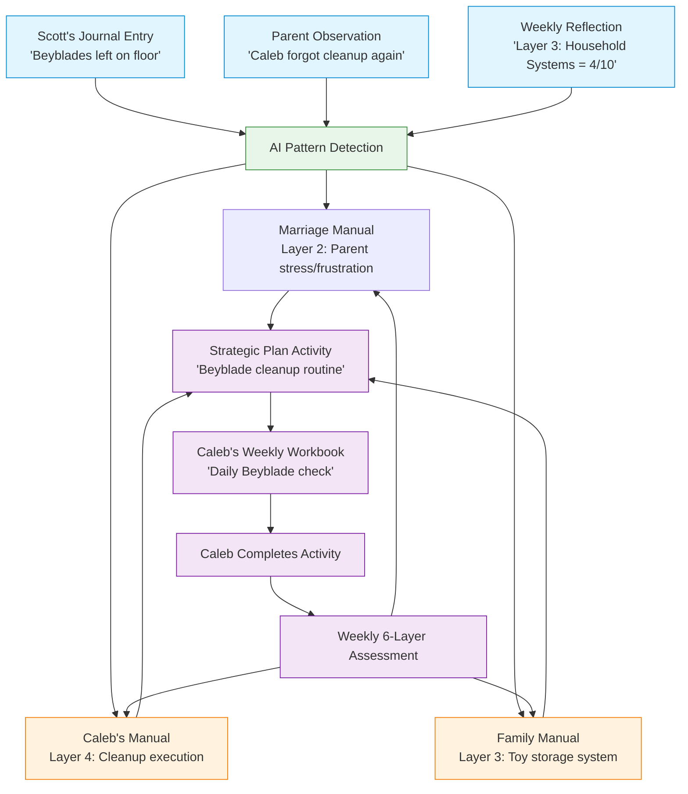

# Relish: 6-Layer Scaffolding + Hierarchical Goal System Design

## Executive Summary

**The Core Question:**
Not "Am I a good parent?" or "Am I a good spouse?"
But: **"Am I being a good parent today?"** / **"Am I being a good spouse today?"**

This platform supports daily active participation in relationships - showing up, being present, repairing when you stumble, and choosing to be the person you want to be in your relationships TODAY.

**What This Delivers:**
A relationship operating manual (not a productivity system) that invisibly guides families from caring conversations to daily practices. Users answer simple questions about their relationships; the system quietly breaks those desires into year journeys, quarterly themes, monthly focuses, and weekly practices - all while centering on being present TODAY.

**Key Innovations:**
1. **Evidence-Based Assessment**: Multiple-choice onboarding drawn from validated psychology research (Gottman, Attachment Theory, Emotion Coaching, Mindful Parenting)
2. **Daily Practice Frame**: Weekly reflections ask "How did I show up this week?" not "Did I achieve goals?"
3. **Repair as Core Practice**: Daily prompts for acknowledging mistakes and coming back - making relationships resilient
4. **Invisible Structure**: System handles year/quarter/month progression; users just do today's workbook
5. **AI Magic + Human Control**: System generates everything from conversations; users review and edit before finalizing

**Philosophy:** This isn't about becoming perfect. It's about showing up, noticing, responding with care, and repairing when you miss the mark. Every day is new.

**Implementation**: 11 phases divided into V1 (Phases 1-7: Foundation) and V2 (Phases 8-11: AI Intelligence)

**Critical AI Architecture Decision**: System requires agentic AI framework (CopilotKit or similar) for intelligent generation of custom behavioral systems, not just content templates.

## Context
Integrating the 6-layer scaffolding framework (universal across family relationships) with a hierarchical goal system that drives behavior change across timeframes: Year → Quarter → Month → Week → Day.

## Agentic AI Architecture: System Generation

**The Challenge:**
Traditional AI implementations use templates or simple LLM calls. But Relish needs to **generate, implement, track, and adapt** complex behavioral systems like:
- Custom chip/token economies with specific behaviors, values, rewards
- Visual checklists tailored to this child's triggers and routines
- Co-regulation plans specific to this child's calming needs
- Emotion tracking systems matched to child's developmental level

**Example: Chip Economy Generation**

**What Needs to Happen:**
1. **Discovery Conversation** (AI dialogues with parent)
   ```
   AI: "I notice Caleb struggles with cleanup and gentle hands
   with his sister. A chip system might help. Want to explore this?"

   Parent: "Yes, but I don't know where to start"

   AI: "Let's design this together. What behaviors do you most
   want to encourage?"

   Parent: "Cleanup, gentle hands, homework without arguing"

   AI: "Great. What motivates Caleb? Screen time? Special treats?
   Time with you?"

   Parent: "Screen time and staying up a bit late"

   AI: "Perfect. Let me design a system..."
   ```

2. **System Generation** (AI creates custom system)
   ```typescript
   const chipSystem = {
     name: "Caleb's Chip System",
     chipValue: 1, // Keep it simple

     earnBehaviors: [
       { behavior: "Cleanup toys first time asked", chips: 2, rationale: "High priority - this is a daily struggle" },
       { behavior: "Gentle hands with Ella all day", chips: 3, rationale: "Very important for sibling relationship" },
       { behavior: "Homework without arguing", chips: 2, rationale: "Evening routine stress point" },
       { behavior: "Morning routine complete on time", chips: 1, rationale: "Building consistency" }
     ],

     spendOptions: [
       { reward: "30 minutes screen time", cost: 5, rationale: "Immediate motivation" },
       { reward: "Stay up 15 minutes late", cost: 8, rationale: "Bigger goal to work toward" },
       { reward: "Special dessert", cost: 3, rationale: "Quick win option" },
       { reward: "Choose family movie night movie", cost: 12, rationale: "Weekly goal, involves family" }
     ],

     rules: [
       "Earn chips throughout the day",
       "Can save chips or spend them",
       "Chips reset weekly (use them or lose them encourages spending)",
       "Both parents can award chips"
     ],

     ageAppropriate: "8 years old",
     visualTracker: "physical_jar", // or "app", "chart"
     integrationPoints: {
       manual: ["cleanup trigger", "sibling conflict trigger", "homework trigger"],
       workbook: "daily_chip_tracker",
       layerFocus: [3, 4] // Structure & Execution layers
     }
   };
   ```

3. **Implementation** (AI adds to manual & workbook)
   - Adds chip system to Caleb's manual as "What Works"
   - Creates daily tracker in weekly workbook
   - Generates parent-facing explanation
   - Creates kid-friendly visual tracker for Caleb

4. **Tracking & Accounting**
   ```typescript
   interface ChipLog {
     date: Timestamp;
     behavior: string;
     chipsEarned: number;
     awardedBy: string; // parent ID
     notes?: string;
   }

   interface ChipTransaction {
     date: Timestamp;
     type: 'earn' | 'spend';
     amount: number;
     description: string;
     balance: number;
   }

   interface ChipSystemState {
     systemId: string;
     personId: string;
     currentBalance: number;
     weeklyEarned: number;
     weeklySpent: number;
     transactions: ChipTransaction[];
     effectivenessRating: number; // 1-10
     needsAdjustment: boolean;
   }
   ```

5. **Monitoring & Adjustment** (AI analyzes effectiveness)
   ```typescript
   async function analyzeChipSystem(systemId: string, weeks: number = 4) {
     const logs = await getChipLogs(systemId, weeks);

     const analysis = {
       mostEarnedBehavior: "cleanup toys (18 times)",
       leastEarnedBehavior: "gentle hands (4 times)",
       averageWeeklyEarnings: 14.5,
       averageWeeklySpending: 14.2,
       spendingPattern: "immediate" | "saves" | "mixed",
       effectivenessTrend: "improving" | "stable" | "declining",

       suggestions: [
         {
           issue: "Gentle hands rarely earned - too hard?",
           suggestion: "Break into smaller wins: 'Gentle in morning = 1 chip, gentle all day = 3 chips'",
           confidence: 0.85
         },
         {
           issue: "Spending all chips immediately",
           suggestion: "Add bigger reward that requires saving (20 chips = special outing)",
           confidence: 0.92
         }
       ]
     };

     if (analysis.effectivenessTrend === 'declining') {
       await createPendingSuggestion({
         type: 'system_adjustment',
         message: "Chip system needs tweaking - Caleb losing interest",
         suggestions: analysis.suggestions
       });
     }

     return analysis;
   }
   ```

**Why CopilotKit (or Similar) is Needed:**

**CopilotKit Capabilities We Need:**
1. **Conversational AI** - `useCopilotChat()` for discovery dialogues
2. **Action System** - `useCopilotAction()` for generating systems
3. **State Integration** - Seamless integration with React state and Firestore
4. **Streaming** - Real-time generation of system components
5. **Context Awareness** - AI has access to full manual, workbook, history

**Alternative Approaches:**

**Option A: CopilotKit**
- **Pros**: Purpose-built for this, great React integration, handles complexity
- **Cons**: Additional dependency, learning curve
- **Best for**: Complex agentic behaviors, multi-turn conversations, system generation

**Option B: Anthropic Claude API + Custom Architecture**
- **Pros**: Full control, already using Claude
- **Cons**: Have to build all the agentic patterns ourselves
- **Best for**: If we want complete control and have time to build infrastructure

**Option C: Vercel AI SDK + Custom Actions**
- **Pros**: Lightweight, flexible, good React integration
- **Cons**: Less opinionated, more manual setup
- **Best for**: Middle ground between full framework and raw API

**Option D: LangChain Agents**
- **Pros**: Mature ecosystem, many integrations
- **Cons**: More backend-focused, heavier weight
- **Best for**: If generating systems happens server-side

**Recommendation: Start with Option B (Claude API + Custom), Migrate to A (CopilotKit) in V2**

**V1 Approach (Simpler):**
- Use Claude API directly for content generation
- Pre-designed system templates (chip economy, checklists)
- Parent fills in specifics via guided forms
- AI generates personalized copy and recommendations

**V2 Approach (Agentic):**
- Integrate CopilotKit or similar framework
- AI has full conversations about needs
- AI generates completely custom systems from scratch
- AI monitors and proactively suggests adjustments
- AI explains reasoning and trade-offs

**V1 Example (Template-Based):**
```typescript
// Parent clicks "Add Chip System"
// Shows form:
// - Select behaviors to reward (checkboxes)
// - Select rewards Caleb likes (checkboxes)
// - AI generates chip values and rules
const system = await generateChipSystem({
  behaviors: ["cleanup", "gentle_hands", "homework"],
  rewards: ["screen_time", "stay_up_late"],
  childAge: 8,
  manual: calebManual
});
```

**V2 Example (Fully Agentic):**
```typescript
// AI initiates conversation in workbook
<CopilotChat>
  AI: "I notice Caleb's cleanup struggles are still a daily thing.
  Want to try a chip system? I can design one specifically for him."

  [Parent engages in conversation]

  [AI generates, parent reviews, AI implements]
</CopilotChat>
```

**Files Needed for V1 (Foundation):**
- `/src/lib/ai/systemGeneration.ts` - Template-based system generation
- `/src/lib/ai/claudeClient.ts` - Claude API wrapper
- `/src/components/tools/SystemBuilder.tsx` - Guided form for creating systems

**Files Needed for V2 (Agentic):**
- Install CopilotKit or similar
- `/src/lib/copilot/actions/generateChipSystem.ts` - Agentic system generation
- `/src/lib/copilot/actions/adjustSystem.ts` - Monitor and suggest adjustments
- `/src/lib/copilot/actions/analyzeEffectiveness.ts` - Analyze what's working
- `/src/components/copilot/SystemConversation.tsx` - Conversational UI

**Decision Point:**
Should we plan for CopilotKit integration from the start (architecture for it), or build simpler V1 first and migrate?

My recommendation: **Plan architecture for agentic AI now, implement simpler V1 first, upgrade to full agentic in V2.**

## Product Scope: Family Relationships Platform

**V1 In Scope:**
- ✓ Child manuals (Caleb, Ella) - parenting relationships
- ✓ Marriage/partner manual - couple relationship
- ✓ Family/household manual - household systems and values
- ✓ Extended family manuals (future) - grandparents, siblings

**V1 Out of Scope:**
- ✗ Personal development goals (career, hobbies, personal fitness)
- ✗ Adult person manuals (no Scott Manual, no Iris Manual)
- ✗ Individual self-improvement unrelated to family relationships

**The Boundary:** If it's not about family relationships or parenting, it doesn't belong in Relish V1.

## Manual Architecture (V1)

**Three Manual Types:**

1. **Child Manual** (one per child)
   - Caleb's Manual, Ella's Manual
   - Contains relationship sections (RoleSection pattern)
   - "As Son to Scott/Iris", "As Brother to Ella", "As Student"
   - Child-specific triggers, strategies, boundaries, values

2. **Marriage Manual** (one per couple)
   - Scott + Iris shared manual
   - Couple triggers, communication patterns, strategies
   - Relationship dynamics: communication, conflict resolution, intimacy, connection
   - Shared lifestyle goals: date nights, fitness together, sleep improvement, hobbies
   - **Scope:** Anything the couple does together or affects their relationship
   - Layer assessment from both parents' perspectives

3. **Family/Household Manual** (one per household)
   - Nuclear family systems, routines, values
   - Household-specific triggers (morning chaos, cleanup)
   - Household systems (chore charts, storage, schedules)
   - Family-level goals (organization, morning routine)

**No adult person manuals** - Adults appear in Marriage Manual and contribute to Child/Family manuals, but have no personal development goals.

## Workbook Structure: Friendly Hierarchy

Each manual has ongoing goals with a simple progression from big picture → this week:

**User-Facing Language (Friendly & Clear):**
- **Year Goal** = The main thing we're working on this year
- **Quarter Focus** = What we're emphasizing these 3 months
- **This Month** = Our specific focus right now
- **This Week** = What we're doing this week

**Backend Structure** (hidden from users):
- GoalVolume → Quarterly Milestone → Monthly Focus → Weekly Workbook
- System tracks hierarchy for data organization
- Users never see "Volume" or "Issue" terminology

**Example User Experience:**
```
CALEB'S WORKBOOK
Week of May 15-21, 2026

━━━━━━━━━━━━━━━━━━━━━━━━━━━━━━━━━━━━━━━
📍 YOUR JOURNEY

Year Goal: Emotional Regulation & Family Harmony
This Quarter: Recognizing & naming feelings before they get big
This Month: Building emotion vocabulary
This Week: Practice naming emotions every day

━━━━━━━━━━━━━━━━━━━━━━━━━━━━━━━━━━━━━━━

THIS WEEK'S ACTIVITIES
□ Daily emotion chart check-in (5 min)
□ Feelings book at bedtime (10 min)
□ Name emotions when calm (throughout day)

━━━━━━━━━━━━━━━━━━━━━━━━━━━━━━━━━━━━━━━
```

**Multiple Concurrent Goals Per Manual:**
Each manual can have multiple active goals running together:
- Caleb's Goals:
  - "Emotional Regulation" (working on this all year)
  - "School Success" (started in September)
  - "Being a Better Brother" (started in March)

Each goal has its own quarter focus, monthly theme, and weekly activities.

**Parent Workbooks:**
Scott and Iris each receive weekly workbooks with sections:
- **Parenting Section: Caleb** (activities supporting Caleb's active volumes)
- **Parenting Section: Ella** (activities supporting Ella's active volumes)
- **Marriage Section** (activities supporting marriage manual volumes)
- **Family/Household Section** (activities supporting family manual volumes)

Weekly assessment for each section feeds back into respective manuals.

## System Feedback Loops



**Key Insight**: Every input (journal, observation, reflection) can inform multiple manuals simultaneously. Every manual contributes to generating coordinated workbook activities. Progress feeds back into all relevant manuals.

---

## 5 Core System Components (From Feedback Loop)

### 1. INPUT SOURCES
**What they are**: Data entering the system
- Journal entries (text from Scott about daily life)
- Parent observations (structured notes about child behavior)
- Weekly reflections (qualitative answers to reflection questions)
- Activity completions (boolean tracking of workbook tasks)

**Implementation**: Already exists in various forms
- Journal entries: Firestore collection
- Observations: Part of workbook or manual notes
- Reflections: ParentWorkbook reflection fields
- Completions: GoalCompletion[] arrays

**Gap**: No unified input schema for AI to process across all types

---

### 2. AI PATTERN DETECTION
**What it is**: The intelligence layer that analyzes inputs and updates manuals

**Current state**: Partially implemented
- `generateDailyActions` cloud function analyzes journals
- `generateStrategicPlan` creates plans from manual content
- No cross-manual pattern detection yet

**Needed**:
- Cloud function that processes new inputs (journal/observation/reflection)
- Detects which manuals are relevant (person, family, relationships)
- Generates suggestions for manual updates (triggers, strategies, boundaries)
- Tags content with manual IDs + layer IDs

**Implementation gap**: This is the missing "smart routing" layer

---

### 3. MANUALS (Knowledge Base)
**What they are**: Person, Family, Spouse manuals storing structured knowledge

**Current state**: Well-implemented
- PersonManual with triggers, strategies, boundaries
- RoleSection for relationship-specific views
- Existing CRUD operations

**Extension needed**:
- Add `familyManualId` reference to link household manual
- Add cross-references: `relatedManualIds[]` on triggers/strategies
- Example: Caleb's "cleanup trigger" links to FamilyManual "toy storage system"

**NEW: Family Manual Type**
- Extends PersonManual structure
- manualType: 'family'
- Same 6-layer scaffolding, family-specific labels

---

### 4. OUTPUTS (Action Generation)
**What they are**: Strategic plans and weekly workbooks generated from manuals

**Current state**: Partially implemented
- Strategic plans defined but not UI built
- Weekly workbooks generate from manual content
- Child activities exist with 20+ types

**Extension needed**:
- Link strategic plans to multiple manuals (not just one person)
- Generate workbook activities that reference cross-manual context
- Example: Caleb's workbook activity references Family cleanup system + Scott's frustration trigger

**Implementation**: Cloud function enhancement to pull from multiple manuals

---

### 5. FEEDBACK LOOP (Progress → Manuals)
**What it is**: Completion data and assessments update the manuals

**Current state**: NOT implemented
- Workbook completions tracked but don't update manuals
- Weekly assessments (NEW from this plan) will track 6-layer scores
- No automatic pattern detection from completion trends

**Needed**:
- Cloud function triggered on weekly reflection submission
- Analyzes completion trends (e.g., "Caleb completed cleanup 6/7 days")
- Updates manual effectiveness ratings (e.g., "Beyblade routine" effectiveness 3→5)
- Suggests new patterns for emerging issues
- Writes back to all relevant manuals (Caleb + Family + Scott)

**Implementation gap**: The "learning loop" - system doesn't currently learn from execution

---

## UI/UX Design Philosophy: Onboarding & Assessments

**The Feeling:** Gorgeous, friendly, inviting, warm, pulsing with life. Not a form - a caring conversation.

### Visual Design Principles

**Typeform-Inspired, But Warmer:**
- **One question at a time** (default) - full focus, no overwhelm
- **Huge, beautiful typography** - 36-48pt for questions, readable from across room
- **Watercolor imagery** - soft, organic, hand-touched feel (not stock photos)
- **Generous whitespace** - breathing room, calm
- **Subtle animations** - questions fade in gently, responses feel acknowledged
- **Progress indicator** - warm, encouraging ("You're doing great")

**Color Palette:**
- Warm, human tones (not corporate blue/gray)
- Soft watercolor washes as backgrounds
- High contrast for readability, but gentle

**Question Presentation Modes:**

**Mode 1: Single Question (Default)**
```
╔═══════════════════════════════════════════════════════╗
║                                                       ║
║  [Soft watercolor wash of parent and child]          ║
║                                                       ║
║                                                       ║
║  When Caleb gets frustrated, what usually            ║
║  helps him calm down?                                ║
║                                                       ║
║  ○ Physical movement (running, jumping)              ║
║  ○ Quiet time alone                                  ║
║  ○ Cuddles and physical comfort                      ║
║  ○ Favorite toy or comfort object                    ║
║  ○ Deep breathing together                           ║
║                                                       ║
║                                    [Continue →]       ║
║                                                       ║
╚═══════════════════════════════════════════════════════╝
```

**Mode 2: Grouped Questions (When Beneficial)**
Used for related items like ranking or comparing:
```
╔═══════════════════════════════════════════════════════╗
║                                                       ║
║  Which of these happen most with Caleb?              ║
║  (Drag to rank your top 3)                           ║
║                                                       ║
║  1. [                Transitions               ]     ║
║  2. [                Sibling conflict          ]     ║
║  3. [                Homework frustration      ]     ║
║     [                Sensory overwhelm         ]     ║
║     [                Hunger/tiredness          ]     ║
║                                                       ║
╚═══════════════════════════════════════════════════════╝
```

**Interaction Patterns:**
- **Radio buttons** styled as warm, rounded selectors (not cold circles)
- **Checkboxes** for "select all that apply" with encouraging micro-copy
- **Text input** with generous sizing, placeholder text feels like gentle prompt
- **Drag-to-rank** for priorities (kinesthetic, engaging)
- **Slider** for scales (1-10) with emoji/word anchors

**Encouragement Throughout:**
- After each answer: Gentle acknowledgment ("Thank you for sharing that")
- Progress milestones: "You're halfway there - you're doing great"
- At completion: "Beautiful. Let's see what we've discovered together."

**Mobile-First:**
- Thumb-friendly tap targets
- Vertical scrolling only
- Large buttons, generous spacing
- Works beautifully on phone (where parents actually are)

---

## Weekly Workbook: Opening a Gift

**Philosophy:** Each week's workbook should feel like opening a carefully prepared gift - anticipated, delightful, personal, beautiful.

**The Arrival Experience:**

**Notification (Sunday evening or Monday morning):**
```
🎁 Your week with Caleb is ready

This week, we're focusing on recognizing
feelings together.

[Open This Week's Workbook]
```

**Opening Animation:**
- Gentle fade-in or "unwrapping" animation
- Beautiful cover image (watercolor, changes weekly based on theme)
- Personalized greeting

**Cover Screen:**
```
╔═══════════════════════════════════════════════════════╗
║                                                       ║
║  [Beautiful watercolor: parent and child connecting] ║
║                                                       ║
║  ✨ CALEB'S WEEK ✨                                   ║
║  May 15-21, 2026                                     ║
║                                                       ║
║  This Week's Journey:                                ║
║  Recognizing Feelings Together                       ║
║                                                       ║
║  "Notice when Caleb's emotions start to build,       ║
║   and help him name what he's feeling"               ║
║                                                       ║
║                        [Begin This Week →]           ║
║                                                       ║
╚═══════════════════════════════════════════════════════╝
```

**Inside the Workbook:**

**Section 1: Progress Celebration**
```
✨ LOOK HOW FAR YOU'VE COME ✨

[Spider diagram animation showing growth]

You've been working on emotional regulation
for 8 weeks now. This is your progress:

• Noticing triggers: 4 → 7
• Understanding feelings: 3 → 6
• Using strategies: 5 → 7

This week, let's keep building on this momentum.
```

**Section 2: This Week's Focus**
Beautiful layout with:
- Theme illustration
- Why we're focusing here (connected to their manual)
- What success looks like this week

**Section 3: Your Tools**
- Active tools presented beautifully
- New tool suggestions feel exciting (not overwhelming)
- Each tool has its own visual identity

**Section 4: Daily Practices**
- Day-by-day breakdown
- Each day feels fresh and achievable
- Mix of activities, observations, reflections

**Section 5: Repair Space**
- Comforting visual design
- Normalizes mistakes
- Makes repair feel safe and positive

**Visual Polish:**

**Color Coding by Theme:**
- Emotional regulation: Soft blues/purples
- Connection/relationship: Warm oranges/pinks
- Structure/routines: Calm greens
- Celebration/growth: Golden yellows

**Typography Hierarchy:**
- Week title: Large, warm, inviting (48-60pt)
- Section headers: Clear, friendly (24-32pt)
- Body text: Readable, conversational (16-18pt)
- Encouragement: Italicized, gentle

**Imagery Throughout:**
- Each section has relevant watercolor illustration
- Not decorative - emotionally resonant
- Shows parents and children in real moments
- Diverse, inclusive representations

**Micro-Interactions:**
- Checking off activities feels satisfying (subtle animation)
- Completing a day reveals encouraging message
- Filling in reflection shows progress visually
- Tool tracking updates in real-time with positive feedback

**End-of-Week Reveal:**
When reflection is completed:
```
╔═══════════════════════════════════════════════════════╗
║                                                       ║
║  ✨ YOU DID IT ✨                                     ║
║                                                       ║
║  You showed up for Caleb this week.                  ║
║                                                       ║
║  [Beautiful animation of spider diagram updating]    ║
║                                                       ║
║  Here's what you noticed:                            ║
║  • You were more patient during transitions          ║
║  • You repaired twice when you lost your cool        ║
║  • Caleb used his emotion words 4 times              ║
║                                                       ║
║  Every day, you're choosing to show up.              ║
║  That's what matters.                                ║
║                                                       ║
║  Next week arrives Sunday evening.                   ║
║                                                       ║
║              [Preview Next Week]                     ║
║                                                       ║
╚═══════════════════════════════════════════════════════╝
```

**Technical Implementation:**
- Workbook components are pre-rendered beautiful layouts (not plain forms)
- Images optimized and cached for fast loading
- Animations are subtle CSS/SVG (not heavy)
- Print-friendly version available (some families like paper)
- Accessible (screen readers get meaningful content)

**The Feeling We're Creating:**
- Anticipated: "I can't wait to see this week's workbook"
- Supported: "Someone prepared this just for me"
- Capable: "I can do this"
- Celebrated: "My efforts matter and are seen"
- Connected: "This helps me be the parent I want to be"

---

## Manual Creation: Onboarding Flow

**Core Principle:** Users aren't familiar with 6-layer framework, so ask questions they CAN answer about their actual relationships. AI organizes responses into structure.

**Not a Form. A Caring Conversation.**

**Applies To All Manual Types:**
- Child Manual onboarding (questions about child's inner world, what works, how you want to show up)
- Marriage Manual onboarding (questions about connection patterns, repair, how you want to be together)
- Family/Household Manual onboarding (questions about household rhythm, family values, how home feels)

### Two Onboarding Paths (For Each Manual)

**Path A: Comprehensive (45-60 minutes)**
- Similar to current child onboarding
- 30-40 multiple-choice and ranking questions
- Covers all 6 layers in depth
- Results in detailed manual ready to use

**Path B: Streamlined (10-15 minutes)**
- Shorter question set (10-15 questions)
- Gets manual started quickly
- **System actively guides gap-filling over time** (not passive waiting)

### Active Gap Detection & Filling

**The System Continuously Identifies What's Missing:**

After initial onboarding (comprehensive or streamlined), the system analyzes the manual for gaps:

**Manual Gap Types:**
1. **Insufficient Triggers** (<3 documented) - "We don't know enough about what's hard for Caleb"
2. **Missing Routines** (no bedtime, morning, homework routines) - "Key transitions aren't documented"
3. **Weak Strategies** (few strategies or low effectiveness <3) - "We need more tools that work"
4. **Unclear Values** (no stated principles) - "What guides your parenting isn't clear yet"
5. **No Repair Patterns** - "How do you come back after conflicts?"
6. **Untested Layers** (entire layers barely filled) - "Layer 3 needs attention"

**How System Guides Gap-Filling:**

**Weekly Workbook Integration:**
Workbooks include "Manual Building" prompts alongside activities:

```
THIS WEEK'S WORKBOOK
Week of May 15-21

━━━━━━━━━━━━━━━━━━━━━━━━━━━━━━━━━━━━━━━━
ACTIVITIES (Caleb's Emotional Regulation)
□ Daily emotion chart check-in
□ Bedtime feelings book

━━━━━━━━━━━━━━━━━━━━━━━━━━━━━━━━━━━━━━━━
BUILDING YOUR MANUAL

💡 We've noticed you haven't documented a bedtime
   routine for Caleb yet. Let's explore that:

This week, observe:
• What time does bedtime start?
• What are the steps that work?
• Where do struggles happen?

[Quick 2-minute reflection at week's end]

━━━━━━━━━━━━━━━━━━━━━━━━━━━━━━━━━━━━━━━━
```

**Gap-Triggered Mini-Assessments:**
When a specific gap is detected, system presents 3-5 targeted questions:

```
╔═══════════════════════════════════════════════════════╗
║  Let's understand bedtime better                      ║
║                                                       ║
║  When bedtime goes well, what helps?                 ║
║  ○ Consistent time (same every night)                ║
║  ○ Warning before transition                         ║
║  ○ Calming activities (bath, book)                   ║
║  ○ One-on-one time with parent                       ║
║  [Select all that apply]                             ║
║                                                       ║
║  [2 of 5 questions]                   [Continue →]   ║
╚═══════════════════════════════════════════════════════╝
```

**Repair-Specific Gap Filling:**
If no repair strategies documented:

```
This week's focus: Repair

Everyone loses patience sometimes. When you need to
repair with Caleb, what works?

○ Sit down together and talk about it
○ Apologize directly ("I'm sorry I yelled")
○ Physical reconnection (hug, hand on shoulder)
○ Do something fun together to reset
○ Give space first, reconnect later

[This helps us build your repair toolkit]
```

**Prioritization Logic:**
1. **Critical gaps** (no documented strategies for current goal area) - addressed first
2. **Layer-aligned gaps** (gaps in lowest-scoring layers) - get priority
3. **Context-triggered gaps** (homework struggles happen, but no homework routine documented)
4. **Natural timing** (bedtime gaps surface during "evening routine" focus weeks)

**Progress Toward Complete Manual:**
```
CALEB'S MANUAL

Completeness: ████████░░ 75%

Well-Documented:
✓ Common triggers (8 identified)
✓ Emotion coaching strategies (6 documented)
✓ Repair approaches (4 ways)

Need More Detail:
⚠ Bedtime routine (not documented)
⚠ Homework patterns (only 1 trigger identified)
⚠ Sibling conflict repair (no strategies yet)

[Explore Bedtime This Week]
```

**The Experience:**
- User never feels like they're "filling out forms"
- Questions emerge naturally during workbook flow
- Each gap-filling prompt is 2-5 minutes max
- System explains WHY it's asking ("This will help us support you better")
- Always optional, but gently encouraged
- Progress visible, motivating

---

## Research Foundations: Evidence-Based Assessment

**All onboarding questions draw from peer-reviewed, validated psychological measures.**

### Core Research Fields & Validated Measures

**1. Attachment Theory & Parent-Child Relationships**
- **Researchers:** Bowlby, Ainsworth, Dan Siegel
- **Measures Used:**
  - Parental Reflective Functioning Questionnaire (PRFQ) - understanding child's mental states
  - Parenting Stress Index (PSI) - identifying stressful aspects
- **Informs:** Understanding triggers, co-regulation strategies, how we want to show up

**2. Emotion Coaching (Gottman, Siegel & Bryson)**
- **Key Works:** *The Whole-Brain Child*, *The Heart of Parenting*
- **Measures Used:**
  - Coping with Children's Negative Emotions Scale (CCNES) - parent responses to distress
  - Emotion Regulation Questionnaire (ERQ) - how parents regulate own emotions
- **Informs:** Layer 2 (understanding/processing), emotion vocabulary, co-regulation

**3. Gottman Method for Couples**
- **Key Works:** *Seven Principles for Making Marriage Work*, *The Science of Trust*
- **Measures Used:**
  - Sound Relationship House Questionnaires - 9 components of healthy relationships
  - Repair Checklist - ways couples repair after conflict
  - Four Horsemen Assessment - criticism, contempt, defensiveness, stonewalling
- **Informs:** Marriage manual content, conflict patterns, repair strategies, daily connection

**4. Mindful Parenting (Neff, Bögels, Kabat-Zinn)**
- **Key Works:** *Mindful Self-Compassion Workbook*, *Mindful Parenting*
- **Measures Used:**
  - Interpersonal Mindfulness in Parenting (IM-P) - present-moment awareness
  - Self-Compassion Scale (SCS) - self-kindness vs judgment
- **Informs:** "Am I being present today?" frame, repair after mistakes, daily practice

**5. Rupture & Repair Research (Ed Tronick, Jeremy Safran)**
- **Key Concepts:** Goodness of repair > perfect parenting, "good enough" parenting
- **Measures Used:** Repair strategies across parent-child and couple relationships
- **Informs:** Daily repair prompts, normalizing mistakes, repair as resilience-builder

**6. Parenting Styles & Practices (Baumrind, Steinberg)**
- **Measures Used:**
  - Alabama Parenting Questionnaire (APQ) - involvement, positive parenting, discipline
  - Parenting Styles & Dimensions Questionnaire (PSDQ)
- **Informs:** Understanding current approach, boundaries (Layer 3), consistency

**7. Family Systems Theory (Bowen, Minuchin)**
- **Measures Used:**
  - Family Adaptability and Cohesion Evaluation Scales (FACES IV)
  - Family Assessment Device (FAD)
- **Informs:** Family/household manual, roles, systems thinking

**8. Child Development & Temperament (Rothbart, Greene)**
- **Measures Used:**
  - Temperament in Middle Childhood Questionnaire (TMCQ)
  - Strengths and Difficulties Questionnaire (SDQ)
- **Informs:** Understanding child triggers (Layer 1), tailoring strategies

**How We Use These Measures:**
- Adapt items into friendly, conversational multiple-choice questions
- Map responses to 6-layer framework (invisible to user)
- Generate manual content based on validated frameworks
- Track changes using evidence-based dimensions

---

### Onboarding Question Examples (Evidence-Based)

**Instead of:** "Rate Layer 1 triggers" (users don't know what Layer 1 means)

**Ask:**
- "Which situations most commonly trigger frustration for Caleb?" (Layer 1)
  - ☐ Transitions (leaving activities, going to school)
  - ☐ Sensory overwhelm (loud noises, crowded spaces)
  - ☐ Sibling conflict
  - ☐ Hunger/tiredness
  - ☐ Unexpected changes to routine
  - [Rank your top 3]

- "What calms Caleb down when upset?" (Layer 4)
  - ☐ Physical movement (running, jumping)
  - ☐ Quiet time alone
  - ☐ Parent cuddles/physical comfort
  - ☐ Favorite toy or comfort object
  - ☐ Deep breathing exercises
  - [Select all that work]

- "What house rules matter most to your family?" (Layer 3, 6)
  - [Open text or multiple choice]

### AI Processing After Onboarding

1. **Analyze Responses**
   - Extract themes and patterns from answers
   - Identify which content belongs to which layer
   - Detect relationships between answers

2. **Generate Manual Content**
   - Organize into 6-layer structure (backend)
   - Create triggers, strategies, boundaries, values
   - Calculate initial baseline scores (Layer 1=4, Layer 2=6, etc.)

3. **Present for Review**
   ```
   CALEB'S MANUAL (Generated)

   Common Triggers:
   • Transitions from preferred activities → meltdowns (Layer 1)
   • Sibling conflict over toys → physical aggression (Layer 1)
   • Unexpected routine changes → anxiety (Layer 1)

   What Works:
   • 5-minute warnings before transitions (Layer 4, effectiveness: 4/5)
   • Physical movement breaks (Layer 4, effectiveness: 5/5)
   • Visual schedule for routine (Layer 3, effectiveness: 3/5)

   House Rules:
   • Gentle hands with siblings (Layer 3)
   • Ask before taking toys (Layer 3)

   [Edit] [Approve] [Add More]
   ```

4. **User Edits & Approves**
   - User can tweak AI-generated content
   - Add missing information
   - Approve to finalize manual

### Immediate Next Step: Goal Creation Required

After manual creation, system REQUIRES creating first goal:
1. "What's your main goal for Caleb right now?" (becomes Year Goal)
2. "What do you want to focus on this quarter?" (becomes Quarter Focus)
3. Set time commitment (15/30/45 min daily)
4. Set duration (how many quarters will this take? 1-4)
5. Capture baseline 6-layer assessment
6. System generates Week 1 workbook

**No manual can exist without at least one active goal.**

---

## The Living Manual: Delightful Experience Design

**Philosophy:** The manual isn't a database or clinical document - it's a living, beautiful book about this person and how to show up for them.

**For Kids Especially:**
- Age-appropriate language and visuals
- Illustrated (not stock photos - watercolor, warm illustrations)
- Feels like "their special book"
- Interactive where possible (tap to expand, animations)
- Celebrates who they are (not just problems to fix)

**For Adults Too:**
- Clean, magazine-quality design
- Personal, not clinical
- Scannable but also deep
- Evolves visibly (shows growth over time)

---

### Manual Presentation Design

**Cover/Home View:**
```
╔═══════════════════════════════════════════════════════╗
║                                                       ║
║  [Watercolor portrait of Caleb]                      ║
║                                                       ║
║  CALEB'S MANUAL                                       ║
║  Age 8 • 3rd Grade                                   ║
║                                                       ║
║  Our Journey Together                                ║
║  Started: January 2026                               ║
║  Currently focusing on: Emotional Regulation         ║
║                                                       ║
║  ━━━━━━━━━━━━━━━━━━━━━━━━━━━━━━━━━━━━━━━━━━━       ║
║                                                       ║
║  📖 What We've Learned                               ║
║  🛠️ What Works                                        ║
║  💫 How Caleb Shines                                  ║
║  🔄 How We Repair                                     ║
║  📊 Our Progress                                      ║
║                                                       ║
╚═══════════════════════════════════════════════════════╝
```

**Section Design Examples:**

**"What We've Learned" (Triggers)**
```
╔═══════════════════════════════════════════════════════╗
║  WHAT WE'VE LEARNED ABOUT CALEB                      ║
║                                                       ║
║  [Small watercolor: child during transition]         ║
║                                                       ║
║  🌊 Transitions Are Hard                              ║
║                                                       ║
║  Leaving fun activities → Meltdowns                  ║
║  What we notice: Caleb needs time to prepare         ║
║  himself mentally. Sudden stops feel unfair.         ║
║                                                       ║
║  Added: Week 3 • Working on this: Yes ✓             ║
║                                                       ║
║  [Related: 5-Minute Warnings →] [Bedtime Checklist →]║
║                                                       ║
║  ────────────────────────────────────────────────    ║
║                                                       ║
║  [Next trigger card...]                              ║
║                                                       ║
╚═══════════════════════════════════════════════════════╝
```

**"What Works" (Strategies)**
```
╔═══════════════════════════════════════════════════════╗
║  WHAT WORKS FOR CALEB                                ║
║                                                       ║
║  🎯 5-Minute Warnings                                 ║
║                                                       ║
║  Before transitions, give Caleb a heads-up:          ║
║  "5 minutes until cleanup time"                      ║
║                                                       ║
║  Effectiveness: ████████░░ 8/10                      ║
║  We've used this: 23 times                           ║
║                                                       ║
║  Notes: Works best with visual timer. If he's        ║
║  really engaged, may need 10 minutes instead.        ║
║                                                       ║
║  [Edit This Strategy]  [Mark as Not Working]        ║
║                                                       ║
╚═══════════════════════════════════════════════════════╝
```

**"How Caleb Shines" (Strengths/Celebration)**
```
╔═══════════════════════════════════════════════════════╗
║  HOW CALEB SHINES ✨                                  ║
║                                                       ║
║  💙 Deeply caring about his sister                   ║
║  🎨 Creative problem-solver with Legos               ║
║  🤝 Loyal friend who remembers details               ║
║  🌟 Enthusiastic when something interests him        ║
║  💪 Persistent (doesn't give up easily)              ║
║                                                       ║
║  [These are his VIA Character Strengths →]           ║
║                                                       ║
╚═══════════════════════════════════════════════════════╝
```

**"How We Repair" (Repair Strategies)**
```
╔═══════════════════════════════════════════════════════╗
║  HOW WE REPAIR 🔄                                     ║
║                                                       ║
║  When things go sideways, this is how we come back:  ║
║                                                       ║
║  1. Sit together on the couch                        ║
║     Works when: Both calm enough to talk             ║
║                                                       ║
║  2. Physical reconnection (hug, hand on shoulder)    ║
║     Works when: Caleb is ready for touch             ║
║                                                       ║
║  3. Do something fun together (Legos, game)          ║
║     Works when: We need to reset the vibe            ║
║                                                       ║
║  This month, we've repaired: 4 times                 ║
║  (And that's good - it means we're practicing!)      ║
║                                                       ║
╚═══════════════════════════════════════════════════════╝
```

**"Our Progress" (Spider Diagram + Timeline)**
```
╔═══════════════════════════════════════════════════════╗
║  OUR PROGRESS TOGETHER                               ║
║                                                       ║
║  [Interactive spider diagram with animation]         ║
║  [Tap each layer to see specific growth]            ║
║                                                       ║
║  This Quarter's Growth:                              ║
║  • Noticing triggers: 4 → 7                          ║
║  • Understanding feelings: 3 → 6                     ║
║  • Using strategies: 5 → 8                           ║
║                                                       ║
║  ━━━━━━━━━━━━━━━━━━━━━━━━━━━━━━━━━━━━━━━━━━━       ║
║                                                       ║
║  JOURNEY TIMELINE                                    ║
║                                                       ║
║  Jan 2026: Started emotional regulation journey      ║
║  Feb 2026: Added bedtime checklist (game changer!)   ║
║  Mar 2026: Caleb used emotion words unprompted 🎉    ║
║                                                       ║
╚═══════════════════════════════════════════════════════╝
```

**For Child Manuals - Kid-Friendly Version:**

Caleb (age 8) could have his own view of his manual:

```
╔═══════════════════════════════════════════════════════╗
║  CALEB'S BOOK                                        ║
║  All About Me & How I'm Growing                     ║
║                                                       ║
║  [Illustration of Caleb]                             ║
║                                                       ║
║  🌟 Things I'm Really Good At                        ║
║  💪 What I'm Working On                               ║
║  🛠️ Tools That Help Me                                ║
║  😊 How I Feel                                        ║
║                                                       ║
╚═══════════════════════════════════════════════════════╝
```

Simple language, visual, affirming.

**Technical Implementation:**

**Components Needed:**
- **`/src/components/manual/ManualCover.tsx`** - Beautiful cover/home screen
- **`/src/components/manual/TriggerCard.tsx`** - Single trigger with context, visual, connections
- **`/src/components/manual/StrategyCard.tsx`** - Strategy with effectiveness bar, notes, edit options
- **`/src/components/manual/StrengthsSection.tsx`** - Celebration of who they are
- **`/src/components/manual/RepairSection.tsx`** - Repair strategies library
- **`/src/components/manual/ProgressTimeline.tsx`** - Journey milestones with spider diagram
- **`/src/components/manual/KidFriendlyView.tsx`** - Age-appropriate view for children

**Design System:**
- Manual sections use consistent card design
- Each section has its own color/icon for easy scanning
- Generous whitespace (not cramped)
- Typography: Friendly, readable, warm
- Animations: Subtle, delightful (expand/collapse, progress updates)

**Interactive Elements:**
- Tap trigger → see related strategies
- Tap strategy → see effectiveness trend over time
- Tap progress → see weekly spider diagrams timeline
- Add new trigger/strategy feels like adding to a scrapbook, not filling a form

**The Experience:**
Manual feels like:
- A treasured book about someone you love
- Evidence of growth and care
- Living document (updates feel exciting)
- Source of hope (look how far we've come)
- Actionable reference (not just information storage)

---

## Current Architecture Understanding

### Existing Workbook System
- **Weekly Workbooks**: Parent + Child workbooks linked by `weekId`
- **Parent Workbook**: Behavior goals (3-5), daily strategies (7), weekly reflection
- **Child Workbook**: 7-day serialized story + 20+ interactive activities
- **No integration** with goals currently

### Existing Goals (StrategicPlan type in backend)
- **Duration**: 30/60/90 days
- **Structure**: Phases (week ranges), Activities (frequency-based), Milestones (target week)
- **Status**: draft → pending_approval → active → completed
- **Gap**: Not connected to weekly workbook generation

### Existing Assessment
- Self-worth assessment (6 domains, 1-4 Likert scale)
- Strategy effectiveness (1-5 scale)
- No spider diagram visualization
- No baseline/target tracking structure

### Time Horizons (Currently)
```
Goal (30/60/90 days)
  └── Phases (weekly ranges)
      └── Weekly Workbooks (parent + child)
          └── Daily activities/strategies
```

**Missing**: Year goals, Quarter focuses, Monthly themes

---

## Proposed Framework

### 1. Hierarchical Goal Structure

```
YEAR GOAL (Annual)
└── What are we working on this year?
    └── Defined across 6 layers
    └── 1-3 goals per person/relationship

    ↓

QUARTER FOCUS (3 months = ~90 days)
└── What we're emphasizing this quarter
    └── 3-4 focuses within each year goal
    └── Each focus assessed across 6 layers

    ↓

THIS MONTH (Monthly theme = ~30 days)
└── Our specific focus right now
    └── Breaks down quarter focus into actionable themes
    └── 6-layer progress assessment

    ↓

THIS WEEK'S WORKBOOK (Week = 7 days) ← WHAT FAMILIES USE
└── Parent daily strategies (aligned to monthly theme)
└── Child activities (building toward goals)
└── Weekly reflection with 6-layer assessment

    ↓

TODAY (Daily)
└── Parent daily strategy
└── Child daily activity
```

### 2. 6-Layer Scaffolding Applied to Each Timeframe

#### For ANNUAL Objectives:
Each objective defined across all 6 layers:

**Example: "Caleb's Emotional Regulation Development"**

- **Layer 1 (Inputs)**: What triggers does he experience? What emotional inputs are overwhelming?
- **Layer 2 (Processing)**: How does he currently interpret frustration? How are we making sense of meltdowns?
- **Layer 3 (Memory & Structure)**: What routines/rules support regulation? What "family OS" helps him?
- **Layer 4 (Execution)**: What strategies are we implementing? What repair looks like?
- **Layer 5 (Outputs)**: Target outcomes = Self-regulation frequency, Recovery time, etc.
- **Layer 6 (Supervisory)**: Guiding principle = "Connection before correction"

#### For QUARTERLY Milestones:
Break annual objective into 3-4 milestones, each with 6-layer targets

**Q1 Milestone: "Recognize triggers before escalation"**
- Layer 1: Identify top 3 triggers
- Layer 2: Name the emotion ("I'm feeling frustrated")
- Layer 3: Use visual emotion chart daily
- Layer 4: Parent gives warning signs 80% of time
- Layer 5: Escalation reduced from daily → 3x/week
- Layer 6: Principle = "Name it to tame it"

#### For MONTHLY Focus:
One specific aspect to emphasize this month

**Month 1 Focus: "Homework Transition Triggers"**
- Narrow Layer 1 focus on homework-specific inputs
- Practice Layer 2 interpretations specific to this context
- Implement Layer 3 homework routines
- Daily Layer 4 strategies targeting this
- Track Layer 5 homework meltdown frequency
- Reinforce Layer 6 principle in this context

#### For WEEKLY Workbooks:
Current week's tactical execution

**Week 3 Workbook:**
- Parent goals: "Give 10-min warning before homework" (Layer 4)
- Daily strategies: Homework transition practice (Layer 4)
- Child activities: Emotion identification game (Layer 2)
- Weekly reflection: Assess all 6 layers

### 3. Spider Diagram Visualization

#### Data Structure (New Type)
```typescript
interface LayerAssessment {
  layerId: 1 | 2 | 3 | 4 | 5 | 6;
  layerName: string;
  currentScore: 1-10; // 1=baseline/struggling, 10=mastered
  baseline: 1-10; // Starting point
  target: 1-10; // Goal for this timeframe
  confidence: 'emerging' | 'consistent' | 'validated';
  lastUpdated: Timestamp;
  evidence: string[]; // Supporting observations
}

interface SpiderAssessment {
  assessmentId: string;
  personId: string;
  timeframe: 'annual' | 'quarterly' | 'monthly' | 'weekly';
  period: string; // "2024", "2024-Q1", "2024-01", "2024-W03"
  layers: LayerAssessment[]; // Always 6 items
  assessedAt: Timestamp;
  assessedBy: string; // userId
  overallProgress: number; // Aggregate 0-100
}

interface ProgressTimeline {
  personId: string;
  objectiveId: string;
  snapshots: SpiderAssessment[]; // Historical progression
  trend: 'progressing' | 'stalled' | 'regressing';
}
```

#### Assessment Frequency
- **Weekly**: Every workbook reflection includes 6-layer self-assessment (1-10 scale per layer)
- **Monthly**: Automated rollup of 4 weekly assessments
- **Quarterly**: Automated rollup of 3 monthly assessments
- **Annual**: Comparison of 4 quarterly snapshots

#### Visualization (SVG Spider Diagram)
```
     Layer 1 (Inputs)
          /\
         /  \
Layer 6 /    \ Layer 2
       |  •   | (Processing)
Layer 5 \    / Layer 3
         \  /
          \/
     Layer 4 (Execution)

Legend:
• Current score (blue)
○ Target (gray outline)
-- Baseline (gray dashed)
```

### 4. Integration with Existing Systems

#### Goals → Quarterly Focuses
```typescript
// Extend StrategicPlan type (backend name - users see "Goal")
interface StrategicPlan {
  // ... existing fields ...

  // NEW: Capacity awareness (Phase 4 - REQUIRED)
  estimatedDailyMinutes: number;  // Time commitment required

  // NEW: Goal hierarchy (Optional - Future)
  yearGoalId?: string; // Links to annual goal
  quarterFocusId?: string; // Which quarter's focus

  // NEW: 6-layer tracking
  baselineAssessment?: SpiderAssessment; // Initial state
  layerAssessments: SpiderAssessment[]; // Weekly snapshots during plan
}
```

#### Weekly Workbooks → Monthly Focus
```typescript
// Extend WeeklyWorkbook types
interface ParentWorkbook {
  // ... existing fields ...

  // NEW: Goal hierarchy context
  monthlyFocusId?: string;
  quarterlyMilestoneId?: string;
  annualObjectiveId?: string;

  // NEW: 6-layer weekly assessment
  weeklyLayerAssessment?: SpiderAssessment;
}
```

#### Weekly Reflection → Layer Assessment
Enhanced reflection flow:
1. Current questions: "What worked well? What was challenging?"
2. **NEW**: Rate each of 6 layers (1-10 scale with guidance)
3. **NEW**: Which layer needs most focus next week?
4. Generate spider diagram comparing this week vs. baseline

---

## Design Decisions (User Confirmed)

### ✓ Product Scope: Family Relationships Platform (V1)
- **In Scope**: Child manuals, Marriage manual, Family/Household manual
- **Out of Scope**: Personal development, career goals, individual fitness (unless shared couple goal)
- **No adult person manuals** - Adults appear only in Marriage Manual and parenting sections
- **Boundary**: If it's not about family relationships or parenting, it doesn't belong in V1

### ✓ Manual Architecture: Three Types
1. **Child Manual** - One per child (Caleb, Ella) with relationship sections
2. **Marriage Manual** - Shared couple manual including relationship dynamics AND lifestyle goals (date nights, fitness together, sleep improvement)
3. **Family/Household Manual** - Household systems, routines, values

### ✓ Strategic Plan Required
- Every manual MUST have at least one active goal
- Cannot have a manual without a goal - manuals exist to drive change
- Multiple concurrent goals allowed per manual (e.g., Caleb working on 3 different goals)

### ✓ Workbook Structure: Friendly Goal Hierarchy
- **Year Goal** = What we're working on this year (user-facing term)
- **Quarter Focus** = 3-month milestone (user-facing term)
- **This Month** = Monthly theme (user-facing term)
- **This Week** = Weekly activities (user-facing term)
- Example header: "Caleb's Goal: Emotional Regulation | This Quarter: Recognizing Feelings"
- Backend tracks as GoalVolume → Quarterly → Monthly → Weekly (hidden from users)
- Each manual can have multiple concurrent goals running together

### ✓ Parent Workbooks: Multi-Section Structure
Scott and Iris each get weekly workbooks with:
- **Parenting Section: Caleb** (supporting Caleb's active volumes)
- **Parenting Section: Ella** (supporting Ella's active volumes)
- **Marriage Section** (supporting marriage manual volumes)
- **Family/Household Section** (supporting family manual volumes)
Each section has its own 6-layer assessment feeding back to respective manual

### ✓ Onboarding: Multiple-Choice → AI Generation
- Ask questions users can answer (not framework jargon)
- AI organizes responses into 6-layer structure
- Generate manual content for user review/edit
- Two paths: Comprehensive (45-60 min) or Streamlined (10-15 min)
- Immediately after manual creation, user MUST create first strategic plan

### ✓ Layer Naming: Flexible/Togglable
- Store universal layer IDs (1-6) in database
- Display layer names contextually based on manual type:
  - **Child manual**: "Child's Triggers", "Parent's Co-regulation", "Family Routines", etc.
  - **Spouse manual**: "Partner's Patterns", "Understanding Their Perspective", "Shared Agreements", etc.
  - **Personal manual**: "Inputs", "Processing", "Memory & Structure", etc.
- User setting to toggle between "Universal Labels" and "Contextual Labels"

### ✓ Scoring: "Am I Being..." Daily Practice Assessment
- 1-10 slider for each layer in weekly reflection
- Frame: "How did I SHOW UP this week?" (not "How well did I do?")
- Questions ask about being present and intentional, not achieving outcomes
- Guidance text below slider:
  - 1-3: Rarely showed up this way
  - 4-6: Sometimes showed up this way
  - 7-8: Usually showed up this way
  - 9-10: Consistently showed up this way
- Focus on your choices and presence, not results
- No complex rubrics or calculations (keep it intuitive and compassionate)
- Repair is tracked separately (not part of layer scores - it's universal)

### ✓ Weekly Workbook Generation: Target Lowest-Scoring Layers
- After weekly reflection, AI analyzes spider scores
- Next week's workbook emphasizes activities for the 2 lowest-scoring layers
- Example: If Layer 2 (Processing) = 4 and Layer 4 (Execution) = 5, next week focuses on interpretation activities + strategy practice
- Still includes some balance across all layers, but weighted toward need areas

### ✓ Spider Diagram Comparison: Current vs. Baseline
- Primary view shows: Current week (blue solid) vs. Baseline/Start (gray dashed)
- Shows total progress since beginning the strategic plan or annual objective
- Future enhancement: Toggle to show "vs. last week" or "vs. target"

---

## Implementation Phases (Minimal Additions Approach)

### Phase 1: Core Data Model (Layer Assessment Types)
**Goal**: Create minimal types to store 6-layer assessments

**New Files**:
- `/src/types/assessment.ts` - LayerAssessment, SpiderAssessment types

**Extended Files**:
- `/src/types/parent-workbook.ts` - Add `weeklyLayerAssessment?: SpiderAssessment`
- `/src/types/index.ts` (StrategicPlan) - Add `estimatedDailyMinutes: number`, `baselineAssessment?: SpiderAssessment`, and `layerAssessments: SpiderAssessment[]`

**Types to Create**:
```typescript
interface LayerAssessment {
  layerId: 1 | 2 | 3 | 4 | 5 | 6;
  score: 1 | 2 | 3 | 4 | 5 | 6 | 7 | 8 | 9 | 10;
  notes?: string;
}

interface SpiderAssessment {
  assessmentId: string;
  personId: string;
  weekId?: string; // Link to workbook week
  planId?: string; // Link to strategic plan
  layers: LayerAssessment[]; // Always 6 items
  assessedAt: Timestamp;
  assessedBy: string; // userId
}
```

---

### Phase 2: Weekly Reflection UI Enhancement
**Goal**: Add 6-layer "Am I being..." assessment to existing weekly reflection

**Philosophy Shift:** Not "How well did we do?" but "How did I show up this week?"

**Files to Modify**:
- `/src/components/workbook/WeeklyReflection.tsx` (or create if doesn't exist)

**UI Flow**:
1. Existing reflection questions (what worked well, what was challenging)
2. **NEW SECTION**: "How Did You Show Up This Week?"
   - Display 6 questions (one per layer) with contextual framing
   - Each question asks about BEING, not achieving
   - 1-10 slider: "Rarely showed up this way" → "Consistently showed up this way"
   - Optional notes field per layer: "What helped? What got in the way?"
3. **NEW SECTION**: "Repair Check"
   - "Did you need to repair with Caleb this week?"
   - "When you made mistakes, were you kind to yourself?"
4. Submit button saves `SpiderAssessment` + repair data to Firestore
5. Link assessment to current week's ParentWorkbook

**Example Questions (Child Manual - Caleb):**

**Layer 1: Noticing Triggers**
```
This week, were you noticing what triggered
struggles for Caleb?

1────────────5────────────10
[===•═════════════════]  6

Rarely noticed ← → Consistently noticed

Did you catch the early signs? Did you see patterns?
```

**Layer 2: Understanding & Presence**
```
This week, were you understanding what Caleb
was experiencing?

Were you curious about his feelings? Did you stay
present when things got hard?
```

**Layer 3: Creating Structure**
```
This week, were you providing helpful routines
and boundaries?

Did structure support him? Were transitions smoother?
```

**Layer 4: Responding Skillfully**
```
This week, were you using strategies that help?

Did you reach for your tools? Were you intentional
in tough moments?
```

**Layer 5: Seeing Growth & Connection**
```
This week, were you noticing progress and
celebrating moments?

Did you see his growth? Did you appreciate the
good moments?
```

**Layer 6: Living Your Values**
```
This week, were you being the parent you want
to be with Caleb?

Were your actions aligned with your values? Did you
show up with integrity?
```

**Repair Section:**
```
REPAIR CHECK

□ I needed to repair with Caleb this week
  [If checked]: What helped you come back?
  ___________________________________________

□ I made mistakes and was kind to myself
□ I modeled apologizing for Caleb to see
```

**Firestore Write**:
- Collection: `families/{familyId}/assessments/{assessmentId}`
- Also store in `ParentWorkbook.weeklyLayerAssessment`

---

### Phase 3: Spider Diagram Visualization Component
**Goal**: Create SVG spider diagram to display assessment

**New Files**:
- `/src/components/assessment/SpiderDiagram.tsx`
- `/src/lib/spiderDiagramUtils.ts` (calculation helpers)

**Component Props**:
```typescript
interface SpiderDiagramProps {
  currentAssessment: SpiderAssessment;
  baselineAssessment?: SpiderAssessment;
  size?: number; // Default 300px
  showLabels?: boolean; // Default true
  labelMode?: 'universal' | 'contextual'; // User preference
  manualType?: 'child' | 'spouse' | 'personal'; // For contextual labels
}
```

**SVG Structure**:
- Hexagon (6 points, one per layer)
- Radial axes (0-10 scale)
- Current assessment as filled blue polygon
- Baseline as dashed gray polygon
- Layer labels positioned around perimeter
- Responsive sizing

**Display Locations**:
- Weekly reflection completion screen (after submitting scores)
- Workbook detail page header
- Strategic plan progress view
- Manual overview dashboard

---

### Phase 4: Baseline Setting & Capacity Check
**Goal**: Capture baseline when strategic plan starts + minimal capacity awareness check

**Type Extension**:
```typescript
interface StrategicPlan {
  // ... existing fields ...

  // NEW: Effort scoping (REQUIRED at creation)
  estimatedDailyMinutes: number;  // 15, 30, 45, 60, 90, etc.
}
```

**Plan Activation Flow**:
1. **Capacity Check Modal** (before baseline):
   - Ask: "How much time can you dedicate daily?" (required field)
   - Query existing active plans for this person
   - Display simple list of current commitments
   - Show new total daily minutes
   - If total > 60 minutes: Display warning (not blocking)

2. **Baseline Assessment Modal**:
   - Prompt parent: "Before we start, how are things currently across these 6 layers?"
   - Save as `StrategicPlan.baselineAssessment`
   - All future weekly assessments compare to this baseline

**UI Example - Capacity Check**:
```
┌──────────────────────────────────────────┐
│ Quick Check                              │
├──────────────────────────────────────────┤
│ How much time can you dedicate daily?   │
│                                          │
│ [___30___] minutes/day                   │
│                                          │
│ You currently have 1 other active plan:  │
│ • Caleb's Emotional Regulation (25 min)  │
│                                          │
│ New total: 55 min/day                    │
│                                          │
│        [Cancel]  [Continue]              │
└──────────────────────────────────────────┘
```

**Warning if >60 min/day**:
```
⚠️  This exceeds typical capacity (60 min/day)
Consider reducing scope or pausing another plan.
[Proceed Anyway]  [Go Back]
```

**Manual Creation Baseline** (future):
- During initial manual onboarding, optionally capture baseline assessment
- Store in `PersonManual.baselineAssessment`

**Files to Modify**:
- `/src/types/index.ts` (StrategicPlan) - Add `estimatedDailyMinutes: number`
- Strategic plan creation/approval workflow
- Add capacity check modal (before baseline modal)
- Query active plans by `primaryResponsible` person ID

---

### Phase 5: Adaptive Workbook Generation (Hybrid Approach)
**Goal**: Generate next week's workbook based on strategic plan + layer scores + manual gaps

**Cloud Function Enhancement**:
- `/functions/src/workbook/generateWeeklyWorkbook.ts` (or similar)

**Three-Factor Logic**:

1. **Goal Context** (Required - every manual has active goals)
   - Fetch all active goals for this manual
   - Each goal has: Year Goal → Quarter Focus → This Month → This Week
   - Primary focus determined by current month's theme within the goal

2. **Layer Score Analysis**
   - Fetch last week's `SpiderAssessment` from workbook
   - Identify 2 lowest-scoring layers (e.g., Layer 2 = 4, Layer 4 = 5)
   - These layers get priority within the strategic plan domain

3. **Manual Gap Detection**
   - Analyze manual for missing/weak content:
     - Insufficient triggers documented (<3)
     - No documented routines (bedtime, morning)
     - Strategies with low effectiveness (<3)
     - Missing values/principles
   - Prioritize gaps that align with weak layers

**Generation Algorithm**:
```typescript
function generateWeeklyWorkbook(context: {
  activeVolumes: GoalVolume[];        // Strategic plans
  lastWeekAssessment: SpiderAssessment;
  manual: Manual;
}) {
  // 1. Primary focus from strategic plan
  const primaryFocus = activeVolumes[0].currentMonthGoal;

  // 2. Weak layers
  const weakLayers = getLowestScoringLayers(lastWeekAssessment, count: 2);

  // 3. Gaps in weak layer areas
  const prioritizedGaps = detectManualGaps(manual)
    .filter(gap => weakLayers.includes(gap.layerId));

  // 4. Generate activities
  return generateActivities({
    focus: primaryFocus,          // Strategic plan direction
    emphasizeLayers: weakLayers,  // Target weak areas
    fillGaps: prioritizedGaps     // Build missing knowledge
  });
}
```

**Activity Weighting**:
- 60-70% of activities target weak layers + strategic plan focus
- 20-30% fill manual gaps
- 10-20% maintain other layers for balance

**Activity Tagging**:
- Each activity tagged with layer(s) it addresses
- Example: "Emotion check-in" → Layer 2 (Processing)
- Example: "Visual schedule" → Layer 3 (Memory & Structure)

---

### Workbook Tools: Building & Tracking Systems

**Philosophy:** Workbooks don't just suggest activities - they help families BUILD and TRACK tools that work.

**Tool Types Generated:**

**1. Visual Checklists**
- Bedtime routine checklist for Caleb
- Morning departure checklist
- Homework setup checklist
- Generated based on documented routines in manual
- Tracked for completion and effectiveness

**Example:**
```
CALEB'S BEDTIME CHECKLIST
(Created: Week 3, tracking effectiveness)

□ Bath time (7:30pm)
□ PJs on
□ Brush teeth
□ Pick tomorrow's clothes
□ Read book with parent
□ Lights out (8:30pm)

This week's completions: ████░░░ 5/7 days

What's working: Bath time transition is smoother
What's hard: Picking clothes causes delays
```

**2. Token/Chip Economy Systems**
- Tracks what behaviors earn tokens
- Tracks what rewards tokens can buy
- Monitors effectiveness over time
- Adjusts based on what motivates

**Example:**
```
CALEB'S CHIP SYSTEM
(Started: Week 5, current value: 12 chips)

Earn Chips For:
• Gentle hands with sister: 2 chips
• Homework without arguing: 3 chips
• Cleanup toys first time asked: 2 chips

Spend Chips On:
• 30 min screen time: 5 chips
• Special dessert: 3 chips
• Stay up 15 min late: 8 chips

This Week's Pattern:
✓ Earned 18 chips (up from 12 last week)
✓ Most chips earned for cleanup
⚠  Spending all chips immediately - might need bigger rewards
```

**3. Emotion Charts/Meters**
- Feelings wheel
- Emotion thermometer (1-10)
- Calming strategy menu
- Generated when emotion coaching is goal area

**4. Reward Charts**
- Sticker charts for consistent behaviors
- Progress toward bigger goals
- Visual motivation

**5. Co-Regulation Plans**
- "When I feel angry" plan
- Calming toolkit
- Who to go to for help

**Tool Lifecycle:**

**Week 1: Tool Created**
```
Based on your manual, we're creating a bedtime
checklist for Caleb.

[Preview Checklist]  [Customize]  [Add to This Week]
```

**Weeks 2-4: Tool Tracked**
```
BEDTIME CHECKLIST - Week 3

Completions: 5/7 days (71%)
Effectiveness: ████████░░ 8/10

Notes: Bath time is working well, but "pick
clothes" causes delays every time.

[Adjust Checklist]  [Mark as Working]
```

**Week 5+: Tool Refined or Retired**
```
This checklist is working really well!
(8/10 effectiveness, 6/7 completions)

Options:
• Keep using it (it's working!)
• Move clothes-picking to morning routine
• Add reward for full completion
• Archive it (no longer needed)
```

**Integration with Manual:**
- Successful tools → added to "What Works" in manual
- Failed tools → added to "What Doesn't Work" with notes
- Effectiveness ratings inform future tool suggestions

**Data Tracked:**
```typescript
interface WorkbookTool {
  toolId: string;
  toolType: 'checklist' | 'token_economy' | 'emotion_chart' | 'reward_chart' | 'coregulation_plan';
  name: string;
  createdWeek: string; // weekId
  targetPerson: string; // personId
  layerFocus: 1 | 2 | 3 | 4 | 5 | 6;

  // Tool-specific content
  steps?: string[]; // For checklists
  earnBehaviors?: { behavior: string; chips: number }[]; // For token economy
  spendOptions?: { reward: string; cost: number }[]; // For token economy

  // Tracking
  weeklyCompletions: {
    weekId: string;
    completionRate: number; // 0-1
    effectivenessRating: number; // 1-10
    notes: string;
  }[];

  status: 'active' | 'working_well' | 'needs_adjustment' | 'archived';
  effectivenessTrend: 'improving' | 'stable' | 'declining';
}
```

**Workbook Generation Logic (Updated):**
```typescript
function generateWeeklyWorkbook(context) {
  // ... existing logic ...

  // 5. Tool generation & tracking
  const activeTools = getActiveTools(personId);
  const toolsNeedingAttention = activeTools.filter(t =>
    t.effectivenessTrend === 'declining' ||
    t.weeklyCompletions.length > 4 && t.effectivenessRating < 5
  );

  const newToolsNeeded = detectToolGaps(manual, weakLayers);

  return {
    activities: [...],
    activeTools: activeTools, // Show in workbook for tracking
    toolsToAdjust: toolsNeedingAttention, // Prompt for refinement
    newToolsToCreate: newToolsNeeded, // Suggest creating
    repairPrompts: [...],
    gapFillingQuestions: [...]
  };
}
```

**UI in Workbook:**
```
THIS WEEK'S WORKBOOK
━━━━━━━━━━━━━━━━━━━━━━━━━━━━━━━━━━━━━━━━
ACTIVITIES
□ Daily emotion check-in
□ Bedtime story routine

TOOLS WE'RE USING
✓ Bedtime Checklist (8/10 working well!)
  [Track This Week]  [View Details]

⚠  Chip System (needs adjustment)
  Caleb is spending chips immediately. Let's add a
  "big prize" option to work toward.
  [Adjust System]

NEW TOOL SUGGESTION
💡 Morning Departure Checklist
  You mentioned morning transitions are hard. A
  visual checklist might help.
  [Create This Tool]  [Not Now]
━━━━━━━━━━━━━━━━━━━━━━━━━━━━━━━━━━━━━━━━
```

---

### Phase 6: Layer Label Configuration
**Goal**: Support both universal and contextual layer names

**New Files**:
- `/src/config/layer-labels.ts`

**Structure**:
```typescript
const UNIVERSAL_LABELS = [
  'Inputs',
  'Processing',
  'Memory & Structure',
  'Execution',
  'Outputs',
  'Supervisory'
];

const CONTEXTUAL_LABELS = {
  child: [
    'Child's Triggers & Patterns',
    'Parent's Understanding & Co-regulation',
    'Family Routines & Boundaries',
    'Daily Parenting Strategies',
    'Child's Development & Growth',
    'Parenting Philosophy & Principles'
  ],
  spouse: [
    'Partner's Patterns & Needs',
    'Understanding Their Perspective',
    'Shared Agreements & Rituals',
    'Daily Connection & Repair',
    'Relationship Quality & Trust',
    'Relationship Values & Vision'
  ],
  family: [
    'Household Demands & Chaos',
    'Family Decision-Making',
    'Household Systems & Routines',
    'Daily Operations & Maintenance',
    'Home Environment Quality',
    'Home Philosophy & Standards'
  ],
  personal: UNIVERSAL_LABELS
};

export function getLayerLabels(
  manualType: 'child' | 'spouse' | 'family' | 'personal',
  mode: 'universal' | 'contextual' = 'contextual'
): string[] {
  if (mode === 'universal') return UNIVERSAL_LABELS;
  return CONTEXTUAL_LABELS[manualType];
}
```

**User Setting**:
- Add to user preferences: `layerLabelMode: 'universal' | 'contextual'`
- Toggle in settings page
- Apply throughout app (spider diagram, reflection form, etc.)

---

## Critical Files (Minimal Additions)

### New Files to Create

**Core Assessment & Tracking:**
1. **`/src/types/assessment.ts`** - LayerAssessment, SpiderAssessment, RepairLog types
2. **`/src/types/repair.ts`** - Repair strategies, repair prompts, repair tracking
3. **`/src/types/workbook-tools.ts`** - WorkbookTool, Checklist, TokenEconomy, EmotionChart types
4. **`/src/components/assessment/SpiderDiagram.tsx`** - SVG spider visualization with animations
5. **`/src/components/assessment/LayerAssessmentForm.tsx`** - "Am I being..." 6-layer form
6. **`/src/hooks/useLayerAssessment.ts`** - Firestore CRUD for SpiderAssessment
7. **`/src/hooks/useRepairTracking.ts`** - Firestore CRUD for repair logs
8. **`/src/hooks/useWorkbookTools.ts`** - CRUD for checklists, token systems, etc.

**Repair Components:**
9. **`/src/components/repair/RepairPrompt.tsx`** - Daily repair check-in component
10. **`/src/components/repair/RepairLibrary.tsx`** - Browse repair strategies by manual type
11. **`/src/components/repair/RepairCelebration.tsx`** - Celebrating when repair happens

**Workbook Tools:**
12. **`/src/components/tools/ChecklistBuilder.tsx`** - Create/edit visual checklists
13. **`/src/components/tools/ChecklistTracker.tsx`** - Track daily completion of checklists
14. **`/src/components/tools/TokenEconomySystem.tsx`** - Chip/token system with earn/spend tracking
15. **`/src/components/tools/EmotionChart.tsx`** - Feelings wheel, emotion meter, calming menu
16. **`/src/components/tools/ToolLibrary.tsx`** - Browse all active tools for a person
17. **`/src/components/tools/ToolEffectivenessCard.tsx`** - Visual card showing tool performance

**Beautiful Workbook Presentation:**
18. **`/src/components/workbook/WorkbookCover.tsx`** - Gift-like opening screen with animation
19. **`/src/components/workbook/ProgressCelebration.tsx`** - Spider diagram with growth narrative
20. **`/src/components/workbook/WeeklyTheme.tsx`** - This week's focus with beautiful layout
21. **`/src/components/workbook/DailySection.tsx`** - Day-by-day breakdown with visual hierarchy
22. **`/src/components/workbook/CompletionCelebration.tsx`** - End-of-week reveal animation
23. **`/src/assets/watercolors/`** - Watercolor imagery collection (organized by theme)

**Onboarding UI:**
24. **`/src/components/onboarding/TypeformQuestion.tsx`** - Single-question-at-a-time beautiful UI
25. **`/src/components/onboarding/ProgressBar.tsx`** - Warm, encouraging progress indicator
26. **`/src/components/onboarding/ManualPreview.tsx`** - AI-generated manual review/edit screen
27. **`/src/components/onboarding/GoalCreation.tsx`** - "How do you want to show up?" goal creation

**Configuration & Research:**
28. **`/src/config/layer-labels.ts`** - Contextual layer names per manual type
29. **`/src/config/evidence-based-questions.ts`** - Onboarding questions mapped to research measures
30. **`/src/config/repair-strategies.ts`** - Gottman/Tronick-based repair approaches per manual type
31. **`/src/lib/spiderDiagramUtils.ts`** - SVG calculation helpers (hexagon points, scaling)
32. **`/src/lib/gapDetection.ts`** - Manual gap detection algorithms
33. **`/src/lib/toolSuggestions.ts`** - Logic for suggesting checklists, token systems, etc.

### Files to Extend
1. **`/src/types/parent-workbook.ts`** - Add `weeklyLayerAssessment?: SpiderAssessment`, `repairLog?: RepairLog[]`
2. **`/src/types/index.ts`** (StrategicPlan) - Add `estimatedDailyMinutes`, `baselineAssessment`, `layerAssessments`
3. **`/src/types/person-manual.ts`** - Add `repairStrategies: RepairStrategy[]` section
4. **`/src/types/marriage-manual.ts`** - Add repair section (Gottman-based)
5. **`/src/components/workbook/WeeklyReflection.tsx`** - Add "Am I being..." assessment + repair check
6. **`/src/components/workbook/DailyWorkbook.tsx`** - Add daily repair prompt
7. **Strategic plan creation/activation flow** - Add capacity check + baseline modals + "how do you want to show up?" framing
8. **Onboarding flow components** - Beautiful Typeform-style one-question-at-a-time UI with watercolor imagery
9. **Cloud function for workbook generation** - Add layer-aware + gap-filling + repair-focused activity weighting

---

### Phase 7: Family Manual Data Model
**Goal**: Create Family Manual type with same structure as PersonManual

**New Files**:
- `/src/types/family-manual.ts` - FamilyManual type definition

**Type Structure**:
```typescript
interface FamilyManual {
  manualId: string;
  familyId: string;
  manualType: 'family';

  // Same 6-layer content as PersonManual
  triggers: ManualTrigger[];           // Layer 1: Household demands
  whatWorks: ManualStrategy[];         // Layer 4: What systems work
  whatDoesntWork: ManualStrategy[];    // Layer 4: Failed approaches
  boundaries: ManualBoundary[];        // Layer 3: House rules

  // Family-specific
  householdSystems: HouseholdSystem[]; // Layer 3: Chore charts, routines, storage
  familyValues: string[];              // Layer 6: Philosophy
  sharedGoals: string[];               // Layer 5: Outcomes

  // Cross-references
  memberManualIds: string[];           // Links to all family member manuals

  // Standard metadata
  version: number;
  lastEditedAt: Timestamp;
  lastEditedBy: string;
}

interface HouseholdSystem {
  systemId: string;
  name: string;                        // "Toy cleanup routine"
  description: string;
  assignedTo: string[];                // Person IDs
  effectiveness: 1 | 2 | 3 | 4 | 5;
  relatedTriggers: string[];           // Links to person manual triggers
}
```

**Firestore Collection**:
- `families/{familyId}/familyManual/{manualId}`

**CRUD Hooks**:
- `/src/hooks/useFamilyManual.ts` - Create, read, update family manual

---

## 🚧 V1 ENDS HERE / V2 STARTS BELOW 🚧

**V1 Delivers**: Complete working system with 6-layer assessments, spider diagrams, workbook generation, and all three manual types. Users can onboard, create manuals, set goals, complete workbooks, and track progress.

**V2 Adds**: AI intelligence layer - cross-manual references, pattern detection, auto-updates from feedback loops, multi-manual coordination.

---

### Phase 8: Cross-Manual References
**Goal**: Enable triggers/strategies to reference content across multiple manuals

**Extended Types**:
```typescript
// Extend existing ManualTrigger
interface ManualTrigger {
  // ... existing fields ...

  // NEW: Cross-manual links
  relatedManualRefs?: ManualReference[];
}

interface ManualReference {
  manualId: string;
  manualType: 'person' | 'family';
  personName?: string;              // Denormalized for display
  contentType: 'trigger' | 'strategy' | 'system' | 'boundary';
  contentId: string;
  layerId: 1 | 2 | 3 | 4 | 5 | 6;
  relationshipDescription: string;  // "Part of family cleanup system"
}
```

**UI Components**:
- `/src/components/manual/CrossManualLinks.tsx` - Display related content from other manuals
- Show on trigger/strategy detail pages
- "This connects to: Family Manual → Toy Storage System, Marriage Manual → Parent frustration with clutter"

**Files to Extend**:
- `/src/types/person-manual.ts` - Add `relatedManualRefs` to triggers/strategies
- `/src/types/family-manual.ts` - Add same to family triggers/systems

---

### Phase 9: AI Pattern Detection & Cross-Manual Routing
**Goal**: Analyze inputs and update multiple manuals simultaneously

**New Cloud Function**: `/functions/src/ai/detectPatternsAndRoute.ts`

**Trigger**: Firestore onCreate/onUpdate for:
- Journal entries
- Parent observations
- Weekly reflections
- Workbook completions

**Logic**:
```typescript
async function detectPatternsAndRoute(input: Input) {
  // 1. Analyze input with AI
  const analysis = await analyzeInput(input);

  // 2. Detect which manuals are relevant
  const relevantManuals = detectRelevantManuals(analysis);
  // Returns: [{ manualId, manualType, confidence, suggestedLayer }]

  // 3. Generate manual updates for each
  for (const manual of relevantManuals) {
    const suggestions = await generateManualSuggestions(input, manual, analysis);

    // 4. Store suggestions (user reviews before accepting)
    await storePendingSuggestion({
      manualId: manual.manualId,
      sourceInput: input,
      suggestedContent: suggestions,
      aiConfidence: analysis.confidence
    });
  }

  // 5. Notify user of pending suggestions
  await notifyPendingSuggestions(familyId);
}
```

**AI Prompts**:
```typescript
// Beyblade example
const analysisPrompt = `
Analyze this journal entry for parenting/family insights:
"${journalText}"

Identify:
1. Which people are involved? (Scott, Caleb, Iris, etc.)
2. Which family systems are mentioned? (cleanup, toys, organization)
3. What emotions/triggers are present?
4. Which 6-layer categories does this touch?

Return JSON with relevant manual IDs and suggested updates.
`;
```

**New Type**: `/src/types/ai-suggestions.ts`
```typescript
interface PendingSuggestion {
  suggestionId: string;
  familyId: string;
  targetManualId: string;
  targetManualType: 'person' | 'family';

  sourceInputType: 'journal' | 'observation' | 'reflection';
  sourceInputId: string;
  sourceText: string;

  suggestedAction: 'add_trigger' | 'add_strategy' | 'update_effectiveness' | 'add_system';
  suggestedContent: any;  // Depends on action type
  layerId: 1 | 2 | 3 | 4 | 5 | 6;

  aiConfidence: 'low' | 'medium' | 'high';
  status: 'pending' | 'approved' | 'rejected';

  // Cross-manual links
  relatedSuggestions: string[];  // Other suggestion IDs from same input

  createdAt: Timestamp;
}
```

**UI**: `/src/components/ai/SuggestionReview.tsx`
- Badge on manual showing "3 AI suggestions pending"
- Review interface: Accept, Edit, or Reject
- Show source (journal entry text that triggered it)
- Show related suggestions across manuals

---

### Phase 10: Feedback Loop Implementation
**Goal**: Completion data updates manual effectiveness automatically

**New Cloud Function**: `/functions/src/feedback/processWeeklyFeedback.ts`

**Trigger**: onUpdate of ParentWorkbook when reflection submitted

**Logic**:
```typescript
async function processWeeklyFeedback(workbookId: string) {
  const workbook = await getWorkbook(workbookId);
  const { completionLogs, weeklyLayerAssessment } = workbook;

  // 1. Analyze completion patterns
  const completionAnalysis = analyzeCompletions(completionLogs);
  // Example: "Caleb completed cleanup 6/7 days this week"

  // 2. Identify which strategies were used
  const strategiesUsed = workbook.parentBehaviorGoals.map(g => g.linkedToStrategy);

  // 3. Update strategy effectiveness based on results
  for (const strategyId of strategiesUsed) {
    const oldEffectiveness = await getStrategyEffectiveness(strategyId);
    const newEffectiveness = calculateNewEffectiveness(
      oldEffectiveness,
      completionAnalysis,
      weeklyLayerAssessment
    );

    // Only update if meaningful change
    if (Math.abs(newEffectiveness - oldEffectiveness) >= 1) {
      await updateStrategyEffectiveness(strategyId, newEffectiveness);
    }
  }

  // 4. Detect new patterns
  const newPatterns = await detectEmergingPatterns(workbook, historicalData);

  // 5. Create suggestions for manual updates
  for (const pattern of newPatterns) {
    await createPendingSuggestion({
      type: 'emerging_pattern',
      pattern: pattern,
      affectedManuals: pattern.relatedManualIds
    });
  }

  // 6. Update all linked manuals
  await updateLinkedManuals(workbook, completionAnalysis);
}
```

**Pattern Detection Examples**:
```typescript
// Example 1: Success pattern
{
  pattern: "cleanup_success",
  description: "Caleb consistently completes cleanup when visual checklist is used",
  data: { successRate: 0.86, weekCount: 3 },
  suggestedAction: "Increase effectiveness rating for 'visual checklist' strategy",
  affectedManuals: [calebManualId, familyManualId]
}

// Example 2: Failure pattern
{
  pattern: "morning_struggle",
  description: "Mornings still chaotic despite Layer 3 (systems) focus",
  data: { layer3Score: 4, morningIncidents: 5 },
  suggestedAction: "Add new trigger: 'Morning routine breakdown' to Family Manual",
  affectedManuals: [familyManualId, calebManualId, ellaManualId]
}
```

**Auto-update Rules**:
- **Effectiveness auto-increment**: Strategy used 5+ times with >80% completion → +1 effectiveness
- **Effectiveness auto-decrement**: Strategy used 3+ times with <40% completion → -1 effectiveness
- **New pattern threshold**: Same issue mentioned in 2+ consecutive reflections → create suggestion

**Files**:
- `/functions/src/feedback/processWeeklyFeedback.ts` - Main feedback processor
- `/functions/src/feedback/patternDetection.ts` - Pattern detection algorithms
- `/functions/src/feedback/effectivenessCalculator.ts` - Calculate new effectiveness scores

---

### Phase 11: Multi-Manual Workbook Generation
**Goal**: Generate workbooks that pull from and reference multiple manuals

**Enhanced Cloud Function**: `/functions/src/workbook/generateMultiManualWorkbook.ts`

**Input Parameters**:
```typescript
interface WorkbookGenerationContext {
  targetPersonId: string;           // Who is this workbook for (Caleb)
  weekId: string;

  // Pull data from multiple manuals
  personManual: PersonManual;       // Caleb's manual
  familyManual: FamilyManual;       // Household manual
  relatedPersonManuals: PersonManual[];  // Scott, Iris, Ella

  // Recent context
  lastWeekAssessment?: SpiderAssessment;
  recentJournalEntries: JournalEntry[];
  activePlans: StrategicPlan[];
}
```

**Generation Logic**:
```typescript
async function generateWorkbook(context: WorkbookGenerationContext) {
  // 1. Identify focus areas from spider assessment
  const focusLayers = identifyLowestScoringLayers(context.lastWeekAssessment);

  // 2. Find relevant content across ALL manuals
  const calebTriggers = context.personManual.triggers;
  const familySystems = context.familyManual.householdSystems;
  const scottFrustrations = context.relatedPersonManuals
    .find(m => m.personName === 'Scott')?.triggers || [];

  // 3. Identify cross-manual connections
  const connectedIssues = findConnectedIssues({
    calebTriggers,
    familySystems,
    scottFrustrations
  });
  // Example: Beyblade cleanup connects Caleb trigger + Family system + Scott frustration

  // 4. Generate activities addressing connected issues
  const activities = [];
  for (const issue of connectedIssues) {
    const activity = await generateActivityForIssue(issue, {
      targetPerson: context.targetPersonId,
      focusLayers,
      relatedManuals: issue.manualRefs
    });
    activities.push(activity);
  }

  // 5. Add cross-manual context to activities
  return activities.map(activity => ({
    ...activity,
    context: {
      manualReferences: activity.relatedManualRefs,
      explanation: generateExplanation(activity)
    }
  }));
}
```

**Activity with Cross-Manual Context**:
```typescript
{
  activityId: "daily-beyblade-check",
  title: "Beyblade Cleanup Check",
  type: "checklist",

  // Links to multiple manuals
  manualReferences: [
    {
      manualId: calebManualId,
      manualType: 'person',
      contentType: 'trigger',
      description: "Caleb's cleanup responsibility trigger"
    },
    {
      manualId: familyManualId,
      manualType: 'family',
      contentType: 'system',
      description: "Family toy storage system"
    },
    {
      manualId: scottManualId,
      manualType: 'person',
      contentType: 'trigger',
      description: "Dad's frustration about floor mess"
    }
  ],

  // Context shown to parent
  parentContext: "This activity addresses Caleb's cleanup struggles (his manual), uses the family toy bin system (family manual), and helps reduce Dad's frustration about clutter (Scott's manual).",

  // Completion feeds back to all 3 manuals
  feedbackTargets: [calebManualId, familyManualId, scottManualId]
}
```

**Files**:
- `/functions/src/workbook/generateMultiManualWorkbook.ts` - Enhanced generation
- `/functions/src/workbook/crossManualConnections.ts` - Find connections
- `/functions/src/workbook/activityExplainer.ts` - Generate parent-facing explanations

---

### Optional Future Enhancements (Post Phase 11)
- Annual objective UI
- Quarterly milestone dashboard
- Monthly focus themes
- Aggregation/rollup functions
- Trend analysis
- Voice journaling integration

---

## Verification & Testing

### Manual Testing Flow
1. **Create baseline assessment**:
   - Start or activate a strategic plan for a child
   - Modal prompts: "Before we begin, rate current state across 6 layers"
   - Submit baseline scores (e.g., Layer 1=3, Layer 2=4, Layer 3=5, Layer 4=4, Layer 5=3, Layer 6=6)
   - Verify saved to `StrategicPlan.baselineAssessment`

2. **Complete weekly reflection**:
   - Navigate to active workbook
   - Complete reflection questions
   - New section: "6-Layer Progress Assessment"
   - Rate each layer 1-10 using sliders
   - Submit reflection
   - Verify `SpiderAssessment` saved to:
     - `families/{familyId}/assessments/{assessmentId}`
     - `ParentWorkbook.weeklyLayerAssessment`

3. **View spider diagram**:
   - After submitting reflection, see spider diagram
   - Blue solid polygon = current week scores
   - Gray dashed polygon = baseline scores
   - Verify layer labels display correctly (contextual for child manual)
   - Test label toggle (universal ↔ contextual) if implemented

4. **Adaptive workbook generation**:
   - Complete Week 1 with low scores in Layer 2 (4) and Layer 4 (5)
   - Generate Week 2 workbook
   - Verify activities weighted toward Layer 2 & 4
   - Check parent strategies and child activities align to focus layers

5. **Historical tracking**:
   - Complete reflections for Weeks 1, 2, 3, 4
   - View strategic plan progress page
   - See multiple spider diagrams or overlay
   - Verify trend shows progress over time

### Data Integrity Checks
- Baseline assessment linked correctly to strategic plan
- Weekly assessments linked to correct workbook week
- Spider diagram calculations accurate (hexagon point positions)
- Layer labels respect user preference setting
- Assessment history persists and is queryable

### Edge Cases
- No baseline set → use first weekly assessment as baseline
- Strategic plan completes → preserve all assessments for historical view
- User changes label preference → all diagrams update dynamically
- Missing weekly assessment → next week's generation uses last available scores
